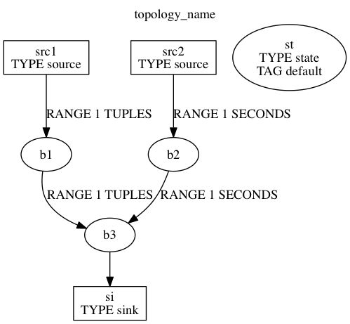

# bqldot

make DOT file for graphviz, from BQL

## Install

### Require

* sensorbee http://sensorbee.io/
    * v0.5.1
* cli https://github.com/urfave/cli
    * v1.18.0

### Install

```bash
$ go get github.com/disktnk/bqldot
$ cd $GOPATH/src/github.com/disktnk/bqldot
$ go install
```

## Usage

```bash
$ bqldot path/to/bqlfile/foo.bql
```

"foo.dot" will be made.

### Example

"sample.bql" is put on "sample" directory

```bash
$ bqldot -t topology_name sample.bql # "sample.dot" will be made
$ dot -Tgif sample.dot -o sample_graph.gif
```

Visualized as:



### TODO

* A UDSF node is not enough to represent the stream. To be completed, use built sensorbee to read UDSF implementation. (And `bqldot` should be subcommand of `sensorbee`.)
* Write keys on each stream nodes.
* A UDS edge. (It is difficult because `topology_builder` does not link UDSs and other nodes, UDSs are read after streaming)

## Reference

* graphviz http://www.graphviz.org/
    * The DOT language http://www.graphviz.org/content/dot-language
